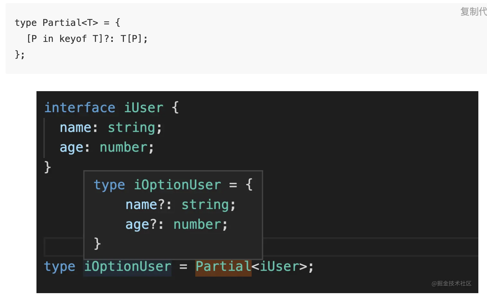
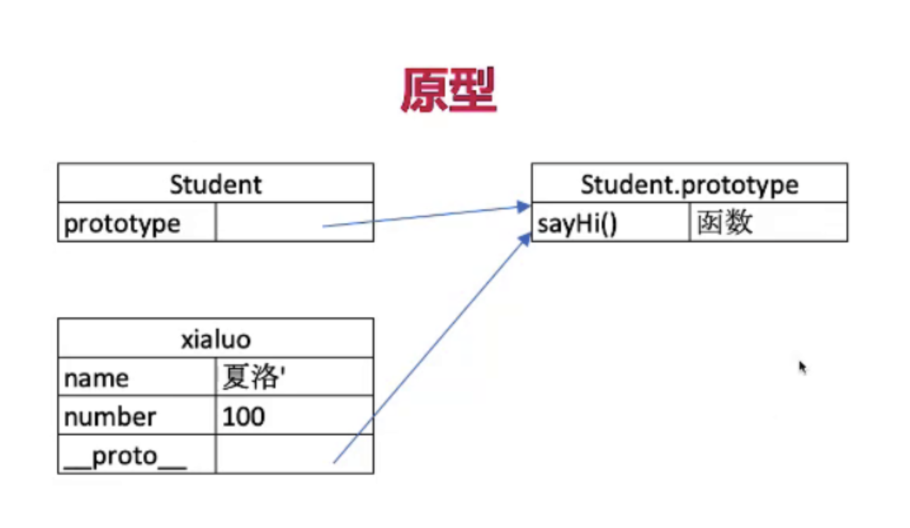
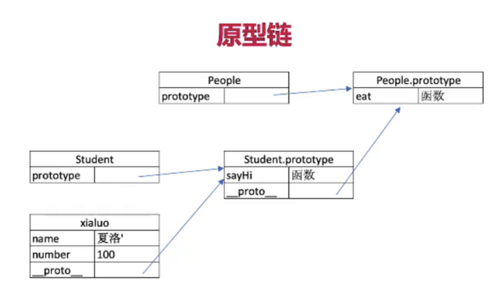
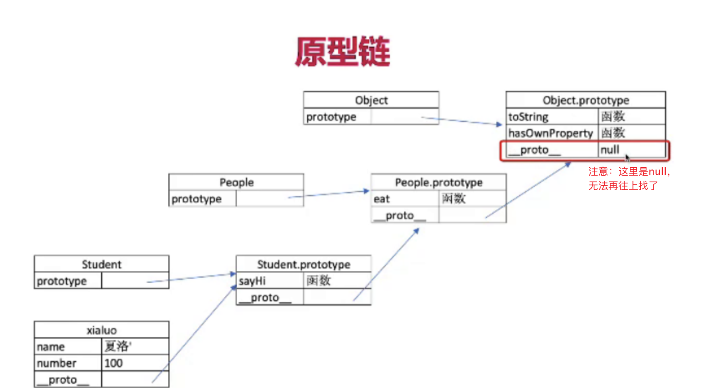
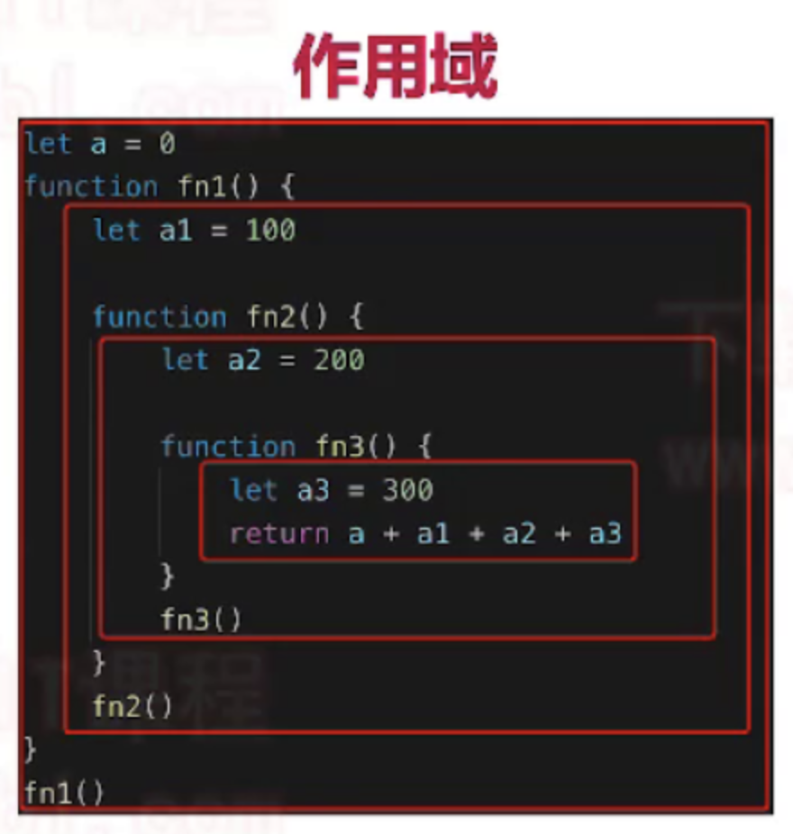

jira 项目需要用到的技术栈： React + hooks + ts + react-query(这是啥？) + react-router + react-toolkit + css in js

react-query 来管理**服务端**全局状态 Performant and powerful data synchronization for React
redux toolkit 管理**客户端**全局状态

可以多对比 React 17 教程
并且结合文档来写代码。代码这么多，光用脑子是肯定记不住的...

### 本项目所遇见的问题 困难 以及解决方法

1. useEffect + 依赖项 造成的无限循环问题  
   解决方法：
   [why-did-you-render](https://github.com/welldone-software/why-did-you-render)
2. useState 惰性初始化数据问题

```
一个库  why-did-you-render   帮我们找到无限渲染的罪魁祸首
无限循环，跟依赖项是 对象 尽管对象值没变，但是引用类型。地址是会不一样的
一般用useMemo来解决。。
```

[无限循环的缩影](https://www.notion.so/useCallback-useMemo-f5add874170f494fafca8ec99449f560)

3. useMemo 和 useCallback 常用情景，要做到心中有数
   [useMemo vs useCallback](https://medium.com/@jan.hesters/usecallback-vs-usememo-c23ad1dc60)

### 本项目特点

1. 自定义钩子函数非常多，且布局巧妙
2. 不仅使用 ts，并且对于 ts 的高级方法也用得很多(类型定义是非常严格的，质量是很高的, 组件透传...)
3. 错误边界
4. 一些陷阱 useEffect 的 闭包问题, useState 的异步问题
5. 使用了最新的 react router 6(因为与 react router 5 差别非常大 )
6. 本项目的 md 里有双越教程里 对于 原型链 闭包 this 的笔记
7. 乐观更新

#### 2-1 用 Create react app 初始化项目

如何初始化一个 ts + react 项目方法就不说了。 React17 项目笔记已经说得非常明白了

src 文件夹会参与打包工具进行打包(webpack 的知识...)
public 文件夹是不参与打包的...

初始化项目后：src 文件夹里的 react-app-env.d.ts、reportWebVitals.ts、setupTests.ts 这三个文件需知道是有什么作用(目前还未知，但项目完成之后应该是要知道才行的)

**注意**: 源代码里如果要使用图片、字体、文件都应该放在 src 文件夹里，然后放在项目里如模块一般使用，而不是放在如 pulic 这类在 src 文件夹之外的文件夹里 (这里应该是与 webpack 打包是有一定关系的)

#### 2-2 配置 eslint、prettier 和 commitlint 规范工程

这一节的配置内容，对于团队的合作、代码格式化有好处(和本次项目其实关系不太大)

**问题 1: 引用文件 相对路径过长**

```
例如： import { calculate } from '../../entry....

解决办法：
首先，在tsconfig.json 文件 加一个配置
"baseUrl": "./src"    // 表示绝对路径会去src文件夹下去找
此时，就可以直接写成  import { calculate } from 'entry';   // 但其实还是有点懵
```

导入文件： import ... from './' 和 没有 './'有啥区别？

**团队统一格式化代码 Prettier**
这个感觉挺牛逼的(挺方便的，只要提交到 git，就会自动格式化代码)
让团队写代码有统一规范的格式：
Prettier 工具
首先安装 Prettier：

```
npm install --save-dev --save-exact prettier

echo {}> .prettierrc.json    // echo 是新建一个文件的意思

npx mrm lint-staged    // Prettier hooks
 npm add eslint-config-prettier// 对eslint 要有一些配置
 .... 还是看视频吧...
```

和 vscode 的 prettier 还是有点区别

> create-react-app 是 自带的 eslint

**提交 commitlint 这个我其实觉得不太方便，算了，不用，有兴趣就看**

#### 2-3 对比常见 Mock 方案 配置 JSON SERVER

(由于在真实环境中，后端和前端并行开发，所以在前期是没有后端接口可以使用的，所以学会最适合自己的 Mock 数据的方法就是非常重要的，下面列举业界常见的 Mock 方案，并选择其中最合适的方案)

##### 1.代码侵入(直接在代码中写死 Mock 数据，或者请求本地的 JSON 文件)

说实话，React 17 就是用的这种方法 估计是应该项目比较简单的原因

优点: 无
缺点:

1. 和其他方案比 Mock 效果不好
2. 与真实 Server 环境的切换非常麻烦(应该不麻烦吧？！)，一切需要侵入代码切换环境的行为都是不好的

##### 2.请求拦截

代表: Mock.js (这是啥？没用过)
帮我们生成随机数据

优点:

1. (相对于代码侵入而言)与前端代码分离
2. 可生成随机数据

缺点:

1. 数据都是动态生成的假数据，无法真实模拟增删改查的情况
2. 只支持 ajax,不支持 fetch

##### 3. 接口管理工具

代表: rap、swagger, moco, yapi(大公司才有)

优点：

1. 配置功能强大，接口管理与 Mock 一体，后端修改接口 mock 也跟着更改，可靠

缺点：

1. 配置复杂，依赖后端，可能会出现后端不愿意出售，或者等配置完了，接口也开发初拉力了的情况。
2. 一般作为大团队的基础建设而存在，没有这个条件的话慎重考虑

##### 4. 本地 node 服务器

代表：json-server

优点：

1. 配置简单，json-server 甚至可以 0 代码，30 秒就启动一个 REST api Server(又是 rest api)
2. 自定义程度高，一切尽在掌握中
3. 增删改查真实模拟
   缺点：
4. 与接口管理工具相比，无法随着后端 api 的修改而自动修改(这个自己也用不着)

```
安装方法：
npm i json-server -g   // 加上sudo 表示全局

启动server： json-server --watch json文件

结合postman 来使用
```

使用 Postman 注意下图几点
必须是 POST 请求 才能设置请求体。且格式应该为 json


有一个比较神奇的点： 我通过 postman 可以更改已经有的数据。更改方法竟然是先在 url 后面/id 跟一个要更改内容的 id。 然后把请求方式改为 PATCH。这是什么操作？(为什么会这样？)。删除方式就是 DELETE

url 后跟参数，这里的内容要多研究研究啊

妈的，什么时候我竟然安装了 yarn 的！哈哈

```
在项目中使用json-server
1. yarn add json-server -D
2. 在根目录新建一个文件夹：__json_server_mock__ (前面__表示文件夹是作为辅助文件存在的)
3. ...
4. 运行： npm run json-server
```

[fetch 知识](https://zhuanlan.zhihu.com/p/24594294)

[PATCH 和 PUT 方法的区别](https://segmentfault.com/q/1010000005685904)

---

关键字搜索功能其实是后端实现的背后逻辑
decodeURIComponent('...') 实现 url 参数的转义和反转义
encodeURI 是用来转义整个 url 的

#### 3-1 用 JSX 列表渲染开发工程列表页面

用`screen`文件夹来存放页面级别的代码

先用 js 来写列表渲染。后面再用 ts 来写

这里很有意思，把一个大组件(ProjectListScreen) 由几个小组件(List 组件、SearchPanel 组件)来拼凑出来

并且这个项目中，起文件名的方式是 - 代替驼峰命名(search-panel 代替 SearchPanel)

> 这一节的重点在于 js 和 react 结合后对于 input、option、onChange 的掌握如何！

react 受控组件问题：挺有意思的 [点击](https://zh-hans.reactjs.org/docs/forms.html)

**因此，总结一点小知识**

- input 标签 常用 的 type 类型
- onChange 事件 e.target.value 的用法

[上述两个问题的解答](https://zh-hans.reactjs.org/docs/forms.html)

- response.ok 代替了 try……catch？
  该属性是来检查 response 的状态是否在 200 - 299（包括 200 和 299）这个范围内。该属性返回一个布尔值

#### 3-2 用状态提升分享数组状态，完成工程列表页面

核心思想就是把 state(状态) 数据放在大组件上(ProjectList 组件上，然后把数据通过 props 传递给小组件 即数据自上向下传递 --- 这是 React 的核心思想)

##### 关于 props 的一些思考

```
// 这里的props 是个对象。 props 相当于 {}  包裹住了 Welcome标签里的自定义的属性  <Welcome name="Sara" />; --> {} + name="Sara" --> props === {name: "Sara"}
function Welcome(props) {
  return <h1>Hello, {props.name}</h1>;
}

const element = <Welcome name="Sara" />;
ReactDOM.render(
  element,
  document.getElementById('root')
);

```

修改 json-server 使用的端口（要知道如何修改 json-server 如何修改端口）

```
package.json:
"json-server": "json-server __json_server_mock__/db.json --watch --port 新端口"
```

**提取地址，避免真实后端接口地址出来的时候再次手动修改源代码接口路径**

> 所有不是修改业务而去修改源代码的行为是不好的行为
> // 这里的用法很有意思，项目开发的时候值得一用
> src 根目录下创建.env 文件 和 .env.development 文件 这里的操作很厉害 这里跟 webpack 的内容是有一定关系的。 然后读取变量：--> process.env...

注意： 使用 process.env...之前要重启项目

- .find() 函数的使用，知道是啥意思，以及如何使用(以及 find 和 ?. 的搭配)
  find() 方法返回数组中满足提供的测试函数的第一个元素的值

```
const array1 = [5, 12, 8, 130, 44];
const found = array1.find(element => element > 10);   // 有返回才行
console.log(found);
```

```
undefind.name   // 这种直接报错~ 可以在chrome 控制台里自己测试
undefind?.name  // 不报错 返回undefined

// 所以这里 人家代码写得太好了。 如果找不到，就显示未知
<td>{users.find(user => user.id === projectId)?.name || '未知'}</td>
```

react 的 map 列表渲染 一定要有 key 值

```
注意一个有趣的事情。
react 的 useState hook 的两个参数都是可以通过组件进行传递的
例如：
const [param, setParam] = useState(...)
// 两个参数都是可以进行传递的
<TestComponent param={param} setParam={setParam} />
```

- url 后跟`/路径`和后端数据 属性之间的关系 例如： http://localhost:3002/projects 和 db.json 文件 projects 属性之间的关系？

- url 后面跟的参数 ?...&... 这些参数有什么用？ 是自己随便想的吗？还是用来对应后端数据的(mysql 的用法)？

在 src 文件夹下创建了一个 utils 文件夹。 cleanObject 功能是把传入的值为空的键(key:value)删掉(但是要知道，在一个函数里，改变传入的对象本身是不好的(讲究函数式编程中不可变值的理念才行，用 es6 解构赋值，创建个新的对象，对新的对象进行操作)...(因为对象是引用类型的，别人用了你的函数，结果对人家原来的对象有改变本身就不好))

cleanObject 的基本结构如下：

```
const cleanObject = (object) => {
    const result = {...object};
    Object.keys(result).forEach((key) => {
        if (!result[key]) {
            delete result[key];
        }
    })
    return result;
}
const obj = cleanObject({j: undefined, k: '123'})
obj   // {k: '123'}
```

Object.keys(对象).forEach(key => ...) // 遍历对象的键并对其进行修改！！ 这招牛啊！！
// 这些有趣的方法真的值得好好了解了解
了解更多有趣的方法: [点击:](https://juejin.cn/post/6995334897065787422)

`forEach()` 方法对**数组**的每个元素执行一次给定的函数。

```
const array1 = ['a', 'b', 'c'];
array1.forEach(element => console.log(element));    // 有返回值的
```

**Object.keys()** 方法会返回一个由一个给定对象的自身可枚举属性组成的**数组**，数组中属性名的排列顺序和正常循环遍历该对象时返回的顺序一致 。

delete object[key] // 这招也厉害 删除对象的属性

人家对于排除 value = 0 值为 false 的方法 用得也妙！！
总而言之，utils 文件夹里的文件代码写得着实妙啊！

`!!`用法 把一个值转化为布尔值，用得巧妙啊！

qs 工具的使用！！ 感觉还可以！
[qs 工具的基本介绍](https://juejin.cn/post/6844904126808227848)

```
安装： npm i qs
使用时要引入qs
import * as qs from 'qs';
```

一个关于 url 参数的问题

> 注意 在 React 中 select 标签有 value 值，且 value 值应该是数字才行

#### 为什么列表要加 key 属性，以及为什么用 index 是不好的

人家说得很好了，我就略了

#### 3-4 学习自定义 Hook - 用 useDebounce 减少工程搜索请求频率

将只执行一次的 useEffect 抽象出来，用 custom hook(把这里的文件放在 utils 里面)
注意，自定义 `hook` 一定要以 **use 开头**，否则报错(因为自定义 hook 里面要用到 react 本身提供的 hook，hook 不能在普通函数里使用，只能在组件或者自定义 hook 中使用)

搜索页面进行防抖操作(避免每按一个键盘按钮，就发一个请求)
debounce 专门用来处理快速的事件

```
普通的debounce操作 运用了闭包操作
const debounce = (func, delay) => {
  let timeout;     // 无论函数执行多少次，timeout只用声明一次
  return () => {
    if (timeout) {
      clearTimeout(timeout);
    }
    timeout = setTimeout(function() {
      func();
    }, delay);    // 如果一直执行debounce则timeout不断恢复为初始值
  }
}

const log = debounce(() => console.log('call'), 5000)
log();
log();
log();   // 只有最后一次log()会被执行 打印 call  前两次，timeout还未执行完就被clear了
```

自己来实现一个

```
useDebounce = (value, delay) => {
  let timeout;
  useEffect(() => {
    if (timeout) {
      clearTimeout(timeout)
    }
    timeout = setTimeout((value) => {return value}, delay)
  }, [value, delay])
}
```

标准的方法(完美的展现了 useEffect 和 useState 的魅力)

```
useDebounce = (value, delay) => {
  const [debouncedValue, setDebouncedValue] = useState(value);  // 注意，作为钩子，本身value只会在一次使用的时候有默认值的效果，后面，默认值效果就没了(这里如果不理解 看双越面试 hook 有讲)

  useEffect(() => {
    const timeout = setTimeout(() => setDebounceValue(value), delay)
    return () => clearTimeout(timeout);  // 每次useEffect 函数执行结束后会执行这个返回的函数 (双越教程也有讲！) 似乎useEffect 的返回值都是一个 用于清理的函数
  }, [value, delay])

  return debouncedValue;
}
```

似乎 useEffect 的返回值必须设置为函数吗？

自定义 hook 最大的特征是要使用其他 hook。如果不使用其他 hook 的话，就充当普通函数就挺好的，没必要弄成自定义 hook

看是否防抖成功是看的 控制台的 network 栏，不是打印栏。。

注意一两个细节：

1. useEffect 如果有 return 返回值，应该是只能返回函数(有待考察)
2. setTimeout 内部的回调函数不一定非得要 return 值，根据情况来定(clearTimeout 道理一样)

**custom hook**效果就是能够 `提取` 并 `复用` 组件代码

#### 4-1 为什么我们需要 ts 真实场景学习 TS 的必要性

如果使用 JS 写项目，那么大部分的错误都是在 runtime(运行时)的时候发现的。使用 TS 就能够在**静态代码**中，就能找到其中的一些错误 -> 强类型的好处！

把项目中 js 文件改为 ts 文件

当我们声明了或定义了某个东西后，是要给其他人用的，既然如此，给人家用，就要给人家**说明书**(我们知道怎么用，但是别人却不知道), `interface`就充当着说明书的作用

下面一段代码，对于函数参数的类型定义用得真好

```
interface SearchPanelProps {
  users: any[],
  param: {
    name: string,
    personId: string
  },
  setParam: (param: SearchPanelProps['param']) => void;    // 这里用得太妙了！！
}

export const SearchPanel = ({users, param, setParam}: SearchPanelProps) => {

```

注意把之前的 js 文件改为 ts 文件后，由于 qs 没有自带 ts 的类型声明文件(没有类型定义)，需要自己去安装一个 qs 的 ts 类型定义文件 (ts 的定义文件只需放在 dev 依赖里就可以，上线的时候不需要用到)

```
npm i --save-dev @types/qs
```

ts 类型定义文件 后缀： .d.ts(说明书文件而已。 .d.ts 文件只是为 js 的核心文件打补丁用的，实质开发时，我们不太常用)

接口之间也能嵌套使用

```
interface User {
  id: string;
  name: string;
  email: string;
  title: string;
  organization: string;
}

interface SearchPanelProps {
  users: User[],       // 接口之间也能嵌套使用
  param: {
    name: string,
    personId: string
  },
  setParam: (param: SearchPanelProps['param']) => void;    // 这里真的就非常讲究了
}
```

几个有意思的点：

```
1.对于对象的类型定义 object
export const cleanObject = (object: object) => ...

2.//@ts-ignore  可以忽略下一行的代码是否使用ts

3.在ts中 如果函数有可选参数，可以写成 ？ 如：(value: any, delay?: number) => {...}
```

[ts + react 优秀指导](https://github.com/typescript-cheatsheets/react#function-components)

#### 4-3 ts 知识梳理、总结与提高

useEffect()里面的回调函数，最后的函数要用花括号包裹，且不要 return (应该是这样的)

为什么常见在函数参数那儿要使用类型定义？ 因为参数无法进行类型推断！所以只能用类型定义了！(按理说，所有声明变量的时候都需要声明类型，只是大多数情况会有类型的自动推断)

ts 中数组和传统的强类型语言的数组差不多

#### 4-5 学习泛型，用泛型增强 useDebounce 类型灵活性

例如 useState 其实也是使用了泛型来定义生成的值是什么类型


泛型优于 typeof 这种能够判断变量类型的语法的地方在于判断类型的时机不一样 泛型在写代码的时候就能判断出类型(静态时发生)。而 typeof 只能在 runtime 的时候才能判断出变量类型

定义泛型的第一件事就是在函数名后面 加`<任意字母(大写)>`

对于箭头函数和普通函数 泛型的位置不一样
例如：
(这里的确要注意一下)

```
// 箭头函数(文件后缀名ts)
const func = <V>(param: V) => ...

// 箭头函数(文件后缀名tsx)
const func = <V extends unknown>(param: V) => ...

// 普通函数
function func<V>(param: V) => ...
```

```
使用泛型是为了解决any和unknown的问题吗？
是为了动态判断类型
```

#### 5-1 用 React 表单、TS 的类型继承和鸭子类型实现登录表单

在 screens 文件夹里创建一个文件夹 login 来实现登录效果
而相比于 React17 项目的登录窗口依赖于 antd，这里是自己用 js 来写(更能展现 js 的能力)

**对于泛型的理解**，使用泛型，我认为一定有一个模板，这个模板有变量(一般用 T 来表示)被<>包裹，而如果要使用这个模板，就要确定<>里的具体类型(就不能再写变量，而是写具体的类型)

比如，有时候会迷惑为啥别人提供的泛型接口我不用变量表示呢？因为人家已经在“后台”给我们弄好了模板，我们是在使用人家的模板，所以应该在<>里写具体的类型，而不是又重复写无意义的变量如 T

泛型默认值也是很有意思

```
interface FormEvent<T = Element> extends SyntheticEvent<T> {
  ...
}
```

```
   const username = (event.currentTarget.elements[0] as HTMLInputElement).value;
   这里使用了as 类型断言是因为 如果没有HTMLInputElement 则 普通的节点Element没有value的属性。而断言为HTMLInputElement 就有value的属性
```

ts 是鸭子类型(duck typing)： 面向接口编程 而不是 面向对象编程

> event.preventDefault() 即阻止表单提交的默认行为

`GET`的 fetch 第二个参数是没有的
`POST` 的 fetch 第二个参数 是要有的！ 主要是为了搞出 Content-Type
登录，一般都是使用`POST`请求吧？！,并且在 post 请求里，似乎一定要指明 Content-Type 类型！！

fetch:[相关文档 1](https://developer.mozilla.org/zh-CN/docs/Web/API/fetch) [相关文档 2](https://developer.mozilla.org/zh-CN/docs/Web/API/Fetch_API/Using_Fetch) [阮一峰老师博客](https://www.ruanyifeng.com/blog/2020/12/fetch-tutorial.html)

一般的 fetch 基本格式如下(`POST`请求)

```
  fetch(`.../...`, {
    method: 'POST',
    headers: {
      'Content-Type': 'application/json'
    },
    body: JSON.stringify(param)   // 这里的内容 其实在双越讲node的视频里有
  }).then(...)
```

`response.ok` 这里的东西值得好好研究研究

json.stringify 是把一个 js 对象或值转化为 JSON 字符串

`json-server` 的一大限制在于只能模拟标准的 `REST api`，登录接口是不符合 `json-server` 的模拟规范的。(事实上，对于项目也不可能全部都符合 REST api 的情况) 用下面的方法，可以让 json-server 中间件来模拟非 REST api 的情况

```
实现原理：json-server里的middleware

在__json_server_mock__文件夹下，创建一个middleware.js 文件
然后用nodejs的语法(CMDjs)来写内容：
// 我TM估计，这里写的就是后端的内容(只不过是nodejs罢了) 就是自己来写一个后端接口
module.exports = (req, res, next) => {
  if (req.method === 'POST' && req.path === '/login') {
    if (req.body.username === 'jack' && req.body.password === '12345') {
      // 请求成功后，返回的状态码
      return res.status(200).json({
        user: {
          token: '123'
        }
      })
    } else {
        return res.status(400).json({message: '用户名或密码错误'})
    }
  }
  next();
}
然后在package.json 里配置...
"json-server": "json-server __json_server_mock__/db.json --watch --port 3001 --middlewares ./__json_server_mock__/middleware.js"

注意：使用json-server前要开启json才行
```

这一节，对于 login/index.tsx 文件 form 表格的使用非常经典。但是我也有几个困惑：

- 1. e.preventDefault() 用法 : **在 React 中另一个不同点是你不能通过返回 false 的方式阻止默认表单提交行为。你必须显式的使用 preventDefault --React 官网** form 的默认行为是表单提交后，会跳转刷新到 action 页面。

- 2. 神奇的(e.currentTarget.elements[0] as HTMLInputElement).value 操作
     我在 react17 里做了 currentTarget 以及 target 的区别。 currentTarget 永远指向事件绑定的元素
     as HTMLInputElement 是强制为 HTMLInputElement 类型(原本是 Element 类型)
     这里的内容最好先死记。

- 3. 以及 fetch 第二个参数的一系列操作
     post 请求似乎要指定 header，而且还要是如下这种

```
const response = await fetch(`${apiUrl}/login`, {
    method: 'POST',
    // 这一步的headers似乎是POST请求必写的内容
    headers: {
      'Content-Type': 'application/json'    // 因为要传入json格式的文件 (post请求似乎一定要这样写才行)
    },
    body: JSON.stringify(param)  // 把传入的对象json化
  });
  if (response.ok) {

  }
```

#### 5-2 连接真实服务器 - 专属开发者工具介绍与安装

这个开发者工具用 MSW 以 `Service Worker` 为原理实现了“分布式后端”

```
安装： npx imooc-jira-tool
```

如果一直安装不起。 先卸载 node_modules 然后再运行 `npx imooc-jira-tool` 再 npm i

#### 5-4 JWT 原理与 auth-provider 实现

jwt 实质是以 token 为核心的~
(JWT 其实在 React17 项目里讲得比较明白了)
token 注意：token 是请求数据后人家后端返回来的(后端做了才有，后端没做，你前端就得不到这个 token！！)
**所以，分清 哪些数据是前端需要做的...哪些是人家后端需要做的...我要分清才行**

JWT:JSON WEB TOKEN ---> 事实上一切都是以 token 为主
jwt 网站：https://jwt.io/

**获取 token 和存储 token**
(我们应该将从后端获取的 token 存放在浏览器(不同浏览器里的 localstorage 是不一样的...这里的知识点，在文件`水哥-哔哩哔哩/本地存储，asiox，基本路由/1.html`里有讲解)的 `localstorage`里面，如何被存放的呢？ 其实就是 localstorage 的几个方法)

**如何运用 token？**
首先，当我们已经把 `token` 存放在了 `Local Storage` 里面了。之后，我每发一次请求，在需要的地方，我会在请求的 header 里带上 token，这样后端就通过某些操作知道是谁在发送请求。

创建一个 auth-provider.ts 文件(这个文件(始终是放在 src 文件夹里的)里写几个函数用来帮助我们操控 jwt 里的 token)。相当于 auth-provider 文件是用来操控 jwt 的...

```
auth-provider.ts
// 在真实环境中，如果公司使用firebase，auth0这种第三方服务的话，本文件不需要开发者开发

const localStorageKey = '__auth_provider_token__';

const apiUrl = process.env.REACT_APP_API_URL;

/* 获取token */
export const getToken = () => window.localStorage.getItem(localStorageKey);    // 从浏览器里的localStorage里获取token

/* 服务器响应的数据(token)放在localStorage里 */
// 注意这里的参数 ts 格式   这里的user 外面的{} 用的是解构方法，毕竟后端解析的数据这里只需要user的内容
export const handleUserResponse = ({user}:{user: User}) => {
  window.localStorage.setItem(localStorageKey, user.token || '')  // 这里的 || 符号用得好
  return user;
}

/* 用户登录的函数 */
const login = async (data: {username: string, password: string}) => {
  const response = await fetch(`${apiUrl}/login`, {
    method: 'POST',
    headers: {
      'Content-Type': 'application/json'
    },
    body: JSON.stringify(data)
  })
  if (response.ok) {
    // 感觉这里不用return应该也可以吧？！
    return handleUseResponse(await response.json())
  }
}

/* 用户注册的函数 */
const register = async (data: {username: string, password: string}) => {
  const response = await fetch(`${apiUrl}/register`, {
    method: 'POST',
    headers: {
      'Content-Type': 'application/json'
    },
    body: JSON.stringify(data)
  })
  if (response.ok) {
    // 感觉这里不用return应该也可以吧？！
    return handleUseResponse(await response.json())
  }
}

/* 用户注销的函数 */
const logout = () => window.localStorage.removeItem(localStorageKey)
```

window.localStorage 的几个基础用法如下：

```
// 存放键值对
localStorage.setItem('myCat', 'Tom');
// 取出指定键的值
localStorage.getItem('myCat');
// 删除指定键值对
localStorage.removeItem('myCat');
// 清理所有的键值对
localStorage.clear();
```

#### 5-5 用 useContext 存储全局用户信息

上一节的登录系统的 token 就是需要进行全局共享都可使用...context 就非常方便
context、useContext 基本语法...直接看官网文档

这个项目里有意思的事情是： context 是单独用一个文件夹来存放 context 的相关内容的...有意思...
`children` 写法:

> fetch 有意思的一些点

```
fetch(...).then((response) => {
  if (response.ok) {   // 注意：因为response 在 4xx 5xx同样会返回response 所以，为了精确限制在2xx的网络请求。有了response.ok
    ...
  } else {
    return Promise.reject(...)    // 手动来限制 如果是在非2xx的网络请求结果，就会报错！
  }
})
```

知道如何指定 useState 泛型

```
const [value, setValue] = useState(null)    // 默认value 类型和传入的值的类型是一致的，此例子则为null
const [value, setValue] = useState<User | null>(null)  // 此时泛型被指定为 User 或 null 类型
```

**null 和 undefined 在 TypeScript 中既是一个值，也是一个类型** 这句话非常的重要

```
<div>
  <input type='text' />
</div>
和下面这种写法一样
<div chidren={<><input type='text' /></>}/>

```

(又是 context 挺有意思的) React 17 其实也是有详细的讲解的

这里似乎是想用 context 来代替 redux
用专门的一个文件夹 context 来放置 全局数据

```
  context
    |--index.ts
    |--auth-context.tsx
```

useState 钩子想要指定参数类型，就<>内部定义泛型的具体类型

```
例如：
const [user, setUser] = useState<User | null>(null)
```

**point free 这个用法搞不懂！**

context 对象提供一个生产者(provider)和消费者(consumer)

遇见的困难是根本无法进行调试

关于 children 的讲解

```
<div>
  <h2>学习</h2>
</div>

等于下面的代码

<div children={<div><h2>学习</h2></div>} />

children 专属 ts 类型，ReactNode(需要从react里导入)


注意，如果要在一个组件标签里显示写children，则该标签必须是闭合标签 例如
✅
<AuthProvider children={children} />
❌
<AuthProvider children={children}>
</AuthProvider>
```

```
组件包裹关系：
AuthProvider
    | 组成
AppProviders --> App
```

**牛逼的是，可以把 children 当作 props 来从组件间传递数据**

#### 5-6 用 useAuth 切换登录与非登录状态

三元运算符要灵活运用才行：

```
例如：
export default function App() {
  const [isRegister, setIsRegister] = useState(true);
  return (
    <button
      onClick={() => {
        setIsRegister(!isRegister);
      }}
    >
      {isRegister ? "登录" : "注册"}
    </button>
  );
}
```

创建一个文件夹 unauthenticated-app 用来装未登录的状态。(需要装载登录 注册 文件)
创建一个文件 authenticated-app.tsx 用来装登录的状态

有一个小 tips 需要注意： response.json() 在一个作用域里只能写一次


**发现了一个问题： 似乎在 if 语句里面 不能写 jsx 语法 ❌ 好像是可以用 jsx 语法的**

#### 5-7 用 fetch 抽象通用 HTTP 请求方法，增强通用性

这里的亮点就是 抽象 http 请求方法。解决代码复用问题！

token 保持了登录状态

保持登录状态(持久性登录) 想想 react17 项目是怎么实现的呢？ 有点忘了！！

封装函数，让异步请求具有通用性。 这种函数作为工具函数，放在 utils 里面

token 标准格式：Bearer(开头) + token (token 是放置在 token 里的)

下面这两个用法要熟悉才行
**window.location.reload() 重新刷新页面用法**
**response.status 用法**

401 是未登录，服务器失效的状态

```
// 这里的接口书写是一个亮点!
interface Config extends RequestInit {
  token?: string;
  data?: object;
}

export const http = async (
  endpoint: string,
  { data, token, headers, ...customConfig }: Config = {}
) => {
  const config = {
    method: "GET",
    headers: {
      Authorization: token ? `Bearer ${token}` : "",   // 这里的写法、针对的就是token意思！
      "Content-Type": data ? "application/json" : "",
    },
    ...customConfig,
  };

  if (config.method.toUpperCase() === "GET") {
    endpoint += `?${qs.stringify(data)}`;      // 在get请求中  data 所起的效果
  } else {
    config.body = JSON.stringify(data || {});  // 在post请求中 data 所起的效果，以及使用的位置
  }

  // axios 和 fetch 的表现不一样，axios可以直接在返回状态不为2xx的时候抛出异常
  return window
    .fetch(`${apiUrl}/${endpoint}`, config)
    .then(async (response) => {
      if (response.status === 401) {
        await auth.logout();
        window.location.reload();       // 页面刷新
        return Promise.reject({ message: "请重新登录" });  // 强制报错
      }
      const data = await response.json();
      if (response.ok) {          // response.ok 请求的状态码: 200~299
        return data;
      } else {
        return Promise.reject(data);
      }
    });
};
```

**注意一个关于`fetch`的问题** fetch 后跟 catch。catch 只会在断网或者网络连接失败的时候才会抛出异常。如果是为了捕获服务端抛出的异常，应该有 if else 逻辑且 else 里面放置 return Promise.reject(data)。 那么问题来了，如果是 try……catch 能有效解决问题吗？(但是要注意，axios 却可以直接返回状态不为 2xx 的时候抛出异常)

nodejs 的知识还得好好学学才行... 的的确确需要后端知识才行啊。。这次项目弄完后 花 15 天还是好好弄弄 nodejs(双越项目) 真的 把 nodejs 搞清楚后，http 的理解就会深很多

#### 额外知识补充:TS type vs interface

#### 5-8 用 useHttp 管理 JWT 和登录状态，保持登录状态

有一个疑问是现在的 env 文件起到了什么作用？ 在哪起的作用？

注意一个问题： 页面刷新后，在 react 所用的钩子，如

```
useState 这种，就会重新进行使用，该钩子的初始值就会被重新来调用
// 所以页面刷新需要重新登录的原因如下
const [user, setUser] = useState<User | null>(null);
重新刷新页面后，user 又获得了初始值即null。用户信息就消失了。 解决方法就是初始值不应该是null 而应该是 其他值。 存储在localstorage里的数据不会因为页面刷新而丢失
```

解决页面刷新需重新登录问题：
原因： auth-context.tsx 文件 user 默认值不能是 null

#### 5-9 TS 的联合类型、partial 和 Omit 介绍

**Utility Types** 充当工具的类型

```
// 联合类型(...或...的类型)
let myFavoriteNumber: string | number
myFavoriteNumber = 7;
myFavoriteNumber = 'seven'

// 类型别名
type jackFavoriteNumber = string | number

在很多情况下，类型别名和interface是可以互换的。二者主要的两个区别如下：
1. interface 无法实现联合类型或交叉类型,但是 type 可以实现
type test1 = string | number
type test2 = string & number

2. interface 没法实现Utility Type
(ts中的typeof 和 js中的typeof 二者是不一样的， js的typeof，是在runtime时运行的，ts中的typeof是在静态环境中运行的)
Parameters<typeof http>    // typeof 能够读出http是一个函数类型。Parameters能够读出<>里面函数类型的参数是什么类型。 这个功能和React 17里面 的 ReturnType 功能很像啊

但是能写type的时候尽量写type

utility type的用法： 用泛型给它传入一个其他类型，然后utility type 对这个类型进行某种操作

type Person = {
  name: string,
  age: number
}
// Partial<> 也是一个Utility Type
const xiaoMing: Partial<Person> = {age: 8}   // name，age都变成可选属性了
const shenMiRen: Omit<Person, 'name'> = {age: 8}    // 只能用age属性，无法有name
```

```
Parmaeters<typeof func>
 typeof func 读出函数类型。  Parameters 读出这个函数类型的参数类型是啥
```

```
常见的utility type 还有 Partial、Omit
Partial<Obj>    // 把Obj对象的所有属性都列出来，而且都是可选的
Omit<Obj, 'propName' | 'otherpropName'>  // 把Obj对象的propName(指定属性名删除,要字符串)
```

```
type Person = {
  name: string,
  age: number
}

type PersonKeys = keyof Person;   // 'name' | 'age'

in 就是遍历的意思
utility type 实现分析
type Partial<T> = {
  [P in keyof T]?: T[P];
}

Pick<Obj, 'propName'>   // Pick 是用来从Obj里挑选指定的属性

Exclude<Obj, 'propName'> // Exclude 是用来从Obj里过滤掉指定的属性。返回剩下的属性

```

类型继承和对象继承 似乎 有点不一样啊

```
K extends keyof T   // 如果T是 'name' | 'id',则K 只能在 'name' | 'id'里选择，已经把类型范围定死了。 这里的extends 提供的仅仅是种约束效果。和 interface的那个extends是有明显不同的
```

#### 5-10 TS 的 Utility Types-Pick、Exclude、Partial 和 Omit 实现

```
// Partial 的实现
type Partial<T> = {
  // keyof 是依次把对象的键取出来  in就是遍历的功能
  [P in keyof T]?: T[P]
}

// Omit 的实现
type Omit<T, K extends keyof any> = Pick<T, Exclude<keyof T, K>>;
```

上面的 Untility 有待之后网上好好查

#### 6-1 安装和使用 antd 组件库

使用 antd + emotion
以及 flex 和 grid 使用

先安装 antd

然后在 index.tsx 文件 导入 antd(这次后缀是 less，因为要自定义 antd 的主题变量)

```
import 'antd/dist/antd/less'
```

从使用 antd 的 Form 可以看出，Form 组件的使用，让原本的 form 标签方便使用了好多...

localeCompare 用法

#### 6-2 为什么我们需要 CSS-in-JS 方案 - 通过传统 CSS 缺陷学习 CSS-in-JS 必要性

#### 最受欢迎的 CSS-in-JS 方案 - Emotion 的安装与使用

```
html {
  使用 rem 相对单位
  16 * 62.5% = 10px  // 浏览器默认的字体大小 16px？
  1 rem === 10px
  font-size: 62.5%;
}
```

```
安装emotion方法：
yarn add @emotion/react @emotion/styled
```

#### 6-3【扩展学习】不再惧怕 CSS CSS-in-JS

[CSS-in-JS](https://coding.imooc.com/lesson/482.html#mid=41843)

emotion 里 控制变量的方法着实感觉不错
emotion 对于写行内样式也非常优秀，可以解决原来 React 里行内样式无法处理级联、伪类等情况

#### 6-4 最受欢迎的 CSS-in-JS 方案 - Emotion

这里须知全局样式放在了 App.css 文件里

```

html {
// 这里的用法非常有意思
// rem 相对于根元素 html 的 font-size (注意是 font-size)
// 浏览器默认的 font-size 是 16px
// 16 * 62.5% = 10px 即 1 rem = 10 px
font-size: 62.5%;
}
```

```

安装 emotion 的方法:

```

yarn add @emotion/react @emotion/styled

```

如果要在文件中使用 css in js。先导入

```

import styled from '@emotion/styled';

```


安装一个对应的语法高亮的插件： vscode-styled-components
似乎react17 的那个css module 也是可以的
```

这种操作和 css Module 还是有一定的不同的

需要注意的是 emotion 用法
对于 html 自带的元素，这样来写

最后生成的都是组件

```
const Test = styled.div `

`
```

如果是例如 antd 带的组件样式修改如下

```
const Test = styled(Input) `
`
```

这样看来似乎是要比 css module 更好用(针对于可以修改 antd 组件样式 并且挺方便的)

注意 `` 就是模板字符串的符号

```
const Header = styled.header `
  background: url(${logo});   // url里面就不用再写 ``了，因为外层就是``
`
```

这一节有个难点 即 对于 background 的使用
多背景 很有意思

```
const Background = styled.div`
  position: absolute;
  width: 100%;
  height: 100%;
  background-repeat: no-repeat;    // 图像不重复
  background-attachment: fixed;    // 在视口内固定
  background-position: left bottom, right bottom;
  background-size: calc(((100vw - 40rem) / 2) - 3.2rem),
    calc(((100vw - 40rem) / 2) - 3.2rem), cover;
  background-image: url(${left}), url(${right});
`;
```

**background**

1. `background-repeat` CSS 属性定义背景图像的重复方式。背景图像可以沿着水平轴，垂直轴，两个轴重复，或者根本不重复。

2. `background-attachment` CSS 属性决定背景图像的位置是在视口内固定，或者随着包含它的区块滚动。

3. `background-position` 为每一个背景图片设置初始位置。 这个位置是相对于由 background-origin 定义的位置图层的。

4. `background-size` 设置背景图片大小。图片可以保有其原有的尺寸，或者拉伸到新的尺寸，或者在保持其原有比例的同时缩放到元素的可用空间的尺寸。

5. `background-image` 属性用于为一个元素设置一个或者**多个背景图像。**

这里的多背景图片是真的有意思

#### Grid 和 Flex

grid-area 用来给 grid 子元素起名字

grid 和 flex 各自的应用场景

1. 要考虑 是一维布局还是二维布局
   一般来说，一维布局用 flex, 二维布局用 grid
2. 是从内容触发还是从布局出发？
   从内容出发：你先有一组内容(数量一般不固定)，然后希望他们均匀的分布在容器中，有内容自己的大小决定占据的空间
   从布局触发：先规划网格(数量一般比较固定)，然后把元素往里填充

从内容出发，用 flex
从布局触发，用 grid

[grid 视频教程](https://www.bilibili.com/video/BV18p411A7JB?from=search&seid=6906517803541556396)
[grid 文章](https://www.ruanyifeng.com/blog/2019/03/grid-layout-tutorial.html)

#### 6-6 用 CSS-in-JS 状态工程创建自定义组件： Row 组件实现

emotion 的变量功能 感觉很厉害
在 src 文件夹下创建一个 components 文件夹 用来存放可以重用的项目级别的组件
这一节 emotion 使用变量是真的厉害

```
> *   这种子元素选择符 感觉有点厉害
```

#### 6-7 完善项目列表样式

使用 emotion 的 内联样式要在该文件下引入下面的内容

```
/**@jsx jsx */
import {jsx} from '@emotion/react';
```

**将时间戳转化为当前时间的方法(专门处理时间的库)**

```
// 安装库
yarn add dayjs

大致展示一下使用方法
{project.created ? dayjs(project.created).format('YYYY-MM-DD') : '无'}

dayjs().format...
```

**针对 svg 图片可以来一点骚操作**
以 svg 的操作

```
import {ReactComponent as SoftwareLogo} from 'assets/software-logo.svg';
以这般步骤导出svg组件 SoftwareLogo。
这样就可以对svg组件当作组件进行样式操作了
例如：
<SoftwareLogo width={'18rem'} color={'rgb(...)'} />
```

#### 6-8 清除前面课程留下的警告信息

**注意**： 在 ts 中，object 类型不仅指 键值对类型的对象，还指函数，正则表达式...
所以如果对一个函数进行解构操作，则会出现这种情况

```
const b = {...() => {}};      // b 就是一个空对象
```

如果想要表示一个类型是键值对。则应该像下面一样来写

这里的内容**非常关键**！

```
{[key:string]:unknown}   // unknown 类似 any 但比any 更加的严谨

let b: { [key: string]: unknown }
```

```
下面这个函数也牛逼
const isVoid = (value: unknown) => value === undefined || value === null || value === ''
```

注意，如果要用超链接 a 就要使用 href。并且如果 href={'#'} 只写一个#是不合法的。如果你想让一个按钮有超链接的样式效果，但又不需要 href。建议使用 antd 的 Button。antd 有个 Button， type='link'的按钮。这个按钮很好

还要注意一件事情: `useEffect` 中的依赖项里加上 `callback` 会造成无限循环，这个和 `useCallback` 以及 `useMemo` 有关系

这里对 react-query 也进行了一定的操作。就不详说了

#### 6-9 你觉得 CSS-in-JS 的方案适合你吗？

**tailwindcss**效果怎么样？
有空可以试试

#### 7-1 给页面添加 Loading 和 Error 状态，增加页面友好性

这里的加载中应该是比 React 17 项目里的转菊花要高级一些
说白了，就是优雅的控制 react 项目中的**异步操作**。以简单的方式提高用户体验

```
interface ListProps extends TableProps<Project> {
  users: User[]
}

type PropsType = Omit<ListProps, 'users'>  // 表示ListProps 类型 排除users属性，剩余的其他属性 即TableProps<Project>
```

类型透传

`Error` 也是一种 ts 类型

#### 7-2 用高级 Hook-useAsync 统一处理 Loading 和 Error 状态

说实话，这里的 useAsync 可以作为一个请求状态的钩子模板了，非常好

```
Partial<T>    // 表示T里面的属性是可选的
```



**有趣的一个知识点 js 解构赋值中使用别名**

```
const object = { number: 10 }
const { number } = object
// 使用别名
const { number: otherNumber } = object
console.log(otherNumber) //10
```

**关于 Promise 的 ts 类型**这里的内容要好好研究研究

#### 复盘前面所学的内容，看看代码，再调整调整代码，理清思路

突然发现，项目几乎全部是以函数的方式来完成的，函数和函数的搭配

发现一个问题： 当使用 usestate 对数据进行更新，并不能立刻获取到最新的数据。
[对应比较好的文章](https://segmentfault.com/a/1190000040013137)

[point free](https://www.ruanyifeng.com/blog/2017/03/pointfree.html)

#### 7-3 登录注册页面 Loading 和 Error 状态处理，与 Event Loop 详解

竟然还有 `onError` 事件
try...catch 执行 异步的时候需要注意注意 使用 async await 代替 promise 解决出现的 promise 中 event loop 情况

确认密码，这个可以直接使用 antd 的方法。也可以自己写。(教程里的就是自己写的)

`response.ok`会在状态码为 2xx 的时候返回 true 其余情况返回 false

```
catch消化异常问题

 return promise
    .then(data => {
      setData(data);
      return data;
    }).catch(error => {
      // catch 会消化异常(??)，如果不主动抛出，外面是接受不到异常的
      setError(error);
      return error;    // 这里的消化异常指的是 即使在catch里，只要代码没报错，会被下一个then接收而非catch接收(双越)
      // 主动抛出异常的方法
      // return Promise.reject(error);
    }).then(err => {
      console.log('err', err);   // 如果前一个catch执行，这里的then会被执行，而不是下一个catch执行

    }).catch(err => {
      console.log('err-catch', err);
    })
```

**注意：useState 是异步执行(event loop 原则，先同步执行，再执行异步代码)** 但 setState 本身是一个同步函数
(要看一个函数是同步还是异步，就看它的返回值。你可以看一下 setState 的类型签名，会发现返回 void 而不是 Promise)

[stackOverflow 里关于 useState 的讨论](https://stackoverflow.com/questions/54069253/usestate-set-method-not-reflecting-change-immediately)

#### 7-4 用 useAsync 获取用户信息

[很好用的钩子系列](https://github.com/streamich/react-use)

#### 7-5 实现 Error Boundaries 捕获错误边界

有些错误是不会被错误边界捕获的

错误边界的实现，一定要用 class 组件来写的
(react 官网文档里有讲解)

```
// <{children: ReactNode, fallbackRender: FallbackRender}, any> 可以写成 React.Component<React.PropsWithChildren<{fallbackRender: FallbackRender}>>
export class ErrorBoundary extends React.Component<{children: ReactNode, fallbackRender: FallbackRender}, any>
```

有一个专门弄错误边界的库：

```
https://github.com/bvaughn/react-error-boundary
```

#### 8-1、 8-2 用 useRef 实现 useDecumentTitle - useRef 与 Hook 闭包详解

**闭包**在 `react hook` 中常见的坑

文档标题 (用自定义的 hook 来改变文档标题)
**React**有 2 种方案

1. 使用 [react helmet](https://github.com/nfl/react-helmet)
2. 自定义一个 hook (见 utils/index.ts useDocumentTitle 组件)

针对 useEffect 处理闭包问题是有讲究的。首先观察 useEffect 的依赖项，如果没有依赖项 是 空数组[]的话，就一定要注意闭包问题

useEffect 依赖问题(如果有多个依赖，必须多个依赖都变化才会触发 useEffect 重新使用？)似乎只要有一个变化就行

useEffect 如果有 return，return 的内容是有**闭包效果**的，这点要注意(闭包这节的知识点可以看看我买的 nolan 老师的小册 里的 闭包内容 讲得挺不错的)

尽量避免 useEffect 闭包的方法, 使用 useRef

```
返回的ref对象在组件的整个生命周期内保持不变

useRef(document.title) 这个就像一个容器，从始至终都帮助我们保存着里面的值(此代码里是document.title)。我们读取这个值的方法：
useRef(document.title).current
```

#### 8-3 添加项目列表和项目详情路由

[react router@6 文档](https://github.com/ReactTraining/react-router/blob/dev/docs/api-reference.md)

[react router 5 和 6 的变化](https://github.com/remix-run/react-router/tree/dev/docs/advanced-guides)

对于单页面应用，路由是必不可少的东西。React Router 是 react 中运用最广的路由库

react-router 就好像是单页面应用的典范

v6 版本的 react-router 比 v5 版本 在 api 的使用上有巨大的更新
安装方法：

```
yarn add react-router@6 react-router-dom@6

yarn add history
```

都安装 beta 版本的

强转字符串的方法： String()

```
<Route path={'/projects/:projectId/*'} element={...}>   // * 通用字符串  这个东西挺有意思的
```

学会用`//TODO` 表示要做但还未做的事
String(num) // 可以把 number 类型强制转化为 string 类型

---

稍微总结一下：react-router6 的使用(仅限 jira 里面的 react-router 操作)

```
1. 进行包裹，被包裹的内容允许路由操作：
import { BrowserRouter as Router } from "react-router-dom";   // 一般都是把BrowserRouter 改为 Router 更加的方便
2. 进行页面路由转化
import { Route, Routes } from "react-router";
<Router>
  <Routes>
    <!-- v6版本的router 允许直接在element 里 再继续Routes操作，并且操作的path是相对路径，相对的是所在组件的路径 -->
    <Route path="/projects" element={<ProjectList />} />
    <!-- 参数操作 -->
    <Route path="/projects/:projectId/*" element={<ProjectScreen />} />
  </Routes>
</Router>
3. 默认路由操作
import { Route, Routes, Navigate } from "react-router";
<Router>
  <Routes>
    <!-- v6版本的router 允许直接在element 里 再继续Routes操作，并且操作的path是相对路径，相对的是所在组件的路径 -->
    <Route path="/projects" element={<ProjectList />} />
    <!-- 参数操作 -->
    <Route path="/projects/:projectId/*" element={<ProjectScreen />} />
     {/* 默认路由, 当该路由之上的内容全都没被选中，则这个路径将被直接选中 */}
    <Navigate to={"/projects"} />
  </Routes>
</Router>
4. Link组件
import { Link } from "react-router-dom";
{/* to{'/project'} 有/ 所以包含了根路由  to{'project'} 就没有包含根路由 有/和没有/区别是很大的 */}
<Link to={"kanban"}>看板</Link>
```

#### 8-4 添加看板和任务组路由

**默认路由：**

```
import { Navigate } from 'react-router;

<Navigate to={}>   // 放在<Routes>里的最后面
```

```
加载到当前页面下的指定路径且页面刷新一次：
<Navigate to={window.location.pathname + '/kanban'}>
```

```
<Link to='...'> 有`/`和没有`/`跟根路由是息息相关的
比如：<Link to={'/kanban'}></Link>
和 <Link to={'kanban'}></Link> 是不一样的。上一个是根路由下的kanban。下面这个是当前路径下的kanban
```

**切换根路由：**

```
这种方法不仅可以重置路由状态，还可以刷新整个页面

window.location.href = window.location.origin

// 重置路由函数
const resetRoute = () => window.location.href = window.location.origin
```

#### 8-5 初步实现

单页面开发应用的特点就是当我们在切换路由的时候，并不会重新加载文档，无论我们怎么切换路由，它们都永远是在同一个文档里的，切换路径的时候页面也不会进行刷新。所有的切换都是通过 js 来实现的(使用 vue 或 react 开发的应用大多都是单页面应用)

---

这也是这个项目的亮点
对于单页面应用。**url 的状态管理**很多人都会去忽略...(非单页面应用，你点击任何内容，对应的 url 是会有对应参数的改变的，刷新页面，读取参数...)我们可以自定义钩子 `useUrlQueryParam` 管理 URL 参数状态。(此自定义钩子是基于 react-router-dom 提供的一个钩子`useSearchParam`来实现的)

[变量作为属性 key](https://es6.ruanyifeng.com/#docs/object)

`as const` 的用法 挺牛逼的

```
const a = ['jack', 12, {gender: 'male'}]
// as const
const a = ['jack', 12, {gender: 'male'}] as const
```

哪些场景需要加`as const`？
返回`tuple`类型，里面的子类型不一样的时候使用 as const

```
const a = ['12'];    // const a: string[];
const a = ['12'] as const;   // const a: readonly['12'];
```

ts 默认数组的元素类型是一致的

**reduce**方法

#### 8-6 用 useMemo 解决依赖循环问题 - Hook 的依赖问题详解

平时如果项目里有无限循环(一般是 useEffect 依赖项问题)问题。 可用下面的库来解决:

```
yarn add @welldone-software/why-did-you-render
```

`useEffect` 依赖性是个对象，看似值没变化，但引用的地址一直在变，就会造成无限死循环

```
function Test() {
  const obj = { name: 'Jack'};     // 每次渲染Test都会重新生成一个obj对象  如果obj只是一个普通类型，就不会导致useEffect依赖性每次对比都不同的情况
  const [num, setNum] = useState(0);

  useEffect(() => {
    console.log('effect');
    setNum(num + 1);  // 这行代码删掉，不会造成死循环。这行代码有，就会造成死循环(obj是object时 和 setNum的搭配造成无限死循环)
  }, [obj])

  setNum(num + 1);

}
```

解决上面问题。使用 react 的 hook `useMemo`

`useMemo` 是能够避免每次渲染都产生一个新的值(减轻性能问题以及防止一些问题出来)

> 把“创建”函数和依赖项数组作为参数传入`useMemo`,它仅会在某个依赖项改变时(对于如 const [data, setData] = useState 的值，只有显示调用 setData 才会证明 data 是更改过的值)才重新计算 memoized 值。这种优化有助于避免在每次渲染时都进行高开销的计算

`useMemo` 对于 `useState` 的数据有奇效！

**一点小总结**
注意：这里的依赖项不局限于`useEffect`这个钩子
基本类型，可以放在依赖项里；组件状态，可以放在依赖里；非组件状态的对象，绝对不可以放在依赖里

**一个测试 react 组件的在线网站**
[网站](https://codesandbox.io/s/cocky-stallman-ll0bu?file=/src/App.js)

**useRef** 发挥着两个作用：

1. 获取节点
2. useRef takes care of returning the same ref each time as on the initial rendering. useRef 负责每次返回与初始呈现时相同的引用。

#### 8-7 完成 URL 状态管理与 JS 中的 iterator 讲解

`iterator` 遍历器 ES6 中的概念
平时使用的 {} [] map 内部都是部署了 iterator 的。特点是可以通过 for……of 进行遍历

```
var a = [1, 2, 3];
for (v of a) {console.log(v)}
// 1
// 2
// 3

// 查看a里部署的iterator的方法
a[Symbol.iterator]  // 显示 f values() { [native code] }
var i = a[Symbol.iterator]();   // 运行
i  // Array Iterator {}
   // __proto__: Array Iterator
   //  next: f next()
i.next()   // {value: 1, done: false}
i.next()   // {value: 2, done: false}
i.next()   // {value: 3, done: false}
i.next()   // {value: undefined, done: true}

next 像指针
```

涉及 this

```
const obj = {
  data: ['hello', 'world'],
  [Symbol.iterator]() {
    const self = this;
    let index = 0;
    return {
      next() {
        this.
      }
    }
  }
}
```

`Object.fromEntries()`方法把键值对列表转换为一个对象

### 前端面试 基础专栏 作用域 闭包 this 原型 (双越)

#### 原型和原型链

##### 题目

- 如何准确判断一个变量是不是数组？
- 手写一个简易的 jQuery,考虑插件和扩展性
- class 的原型本质，怎么理解？

##### 知识点

- class 和 继承
- 类型判断 instanceof
- 原型和原型链

##### 具体讲解

**==>class<==**
`class` 本质上是一个模板。我们可以通过模板来构建一些东西(通过`constructor`来构建一些东西，`属性` 和 `方法`)

```
/* class 模板 */

class Student {   // 类名用大写字母开头
  // 通过constructor来构建, constructor执行过程是什么？
  constructor(name, number) {
    // this 表示当前构建的对象实例
    this.name = name;
    this.number = number;
  }
  // 为什么方法要定义在constructor外，而属性却定义在constructor内？
  sayHi() {
    console.log(
      `姓名 ${this.name}, 学号 ${this.number}`
    )
  }
}

/* 通过类 new一个 对象(实例) */
const xialuo = new Student('xialuo', 100);
console.log(xialuo.name);   // xialuo
console.log(xialuo.number); // 100
xialuo.sayHi();

const madongmei = new Student('马冬梅', 101);
```

**==>继承<==**
(继承 更多的是找各种类的共同点,节省代码的书写)

- `extends` 通过`extends`来执行继承
- `super` 通过`super`来执行父类的构造函数(`constructor`)
- 扩展或重写方法

```
/* 父类 */
class People {
  constructor(name) {
    this.name = name;
  }
  eat() {
    console.log(`${this.name} eat something`)
  }
}

/* 子类 */
class Student extends People {
  // 有个问题是 父类的eat方法该怎么继承呢？跟super有关系吗？ 跟constructor又是什么关系呢？
  constructor(name, number) {
    super(name);  // 这里的name 会放在 父类的constructor里作为参数。这时把super看做父类的constructor
    this.number = number;
  }
  sayHi() {
    console.log(`姓名 ${this.name} 学号 ${this.number}`)
  }
}

const xialuo = new Student('夏洛', 101);
xialuo.eat();   // 可以执行
```

class 中 方法和`constructor`之间的关系如下

```
function Point(x, y) {
  this.x = x;
  this.y = y;
}

Point.prototype.toString = function() {
  return '(' + this.x + ', ' + this.y + ')';
}

======等同于=====

class Point {
  constructor(x, y) {
    this.x = x;
    this.y = y;
  }
  toString() {
    return '(' + this.x + ', ' + this.y + ')';
  }
}
```

**==>类型判断-instanceof<==**

```
xialuo instanceof Student // true
xialuo instanceof People  // true
xialuo instanceof Object  // true

/* Object 是所有class的父类 */

[] instanceof Array   // true
[] instanceof Object  // true

{} instanceof Object  // true
Array instanceof Object // true
Student instanceof Object // true
```

**==>原型<==**

```
// class 实际上是函数，可见是语法糖
typeof People  // 'function'
typeof Student // 'function'
typeof Object  // 'function'
typeof Array   // 'function'

typeof []  // object
typeof {}  // object

// 隐式原型 和 显示原型
console.log(xialuo.__proto__);  // 隐式原型
console.log(Student.prototype); // 显示原型
console.log(xialuo.__proto__ === Student.prototype)   // true
```

---


由上面的原型图可得：
**原型关系**

- 每个 `class` 都有显示原型 `prototype`
- 每个实例都有隐式原型 `__proto__`
- 实例的`__proto__`指向对应`class`的`prototype`
  (注意：原型 `prototype` 本身是一个对象。是引用类型，地址指向真正的存储空间。 故**proto**和 **prototype** 本质都是存储的地址，该地址指向真正的原型对象的存储空间)

**==>基于原型的执行规则<==**

- 获取属性 `xialuo.name` 或执行方法`xialuo.sayhi()` 时
- 先在自身属性和方法寻找
- 如果找不到则自动去**proto**中查找

**==>原型链<==**



```
前面说过 每个实例都有隐式原型 __proto__。Student.prototype 也是一个对象(实例)，所以也有隐式原型

console.log(Student.prototype.__proto__)
console.log(People.prototype)
console.log(People.prototype === Student.prototype.__proto__) // true


xialuo.hasOwnProperty('name');  // true
xialuo.hasOwnProperty('sayHi'); // false
hasOwnProperty方法用于判断该属性是否存在于当前的对象本身(非原型链上的)
```



**再看 instanceof**
A instanceof B 即 A 顺着隐式原型(`__proto__`)去找 B 的显示原型(`prototype`) 如果能找到就返回`true`否则返回`false`

---

**重要提示！！(其实没搞懂下面这三句是想表达什么？)**

- class 是 ES6 语法规范，由 ECMA 委员会发布
- ECMA 只规定语法规则，即我们代码的书写规范，不规定如何实现
- 以上实现方式都是 v8 引擎的实现方式，也是主流的

##### 题目解答

- **如何准确判断一个变量是不是数组？**
  a instanceof Array

```
[] instanceof Array     // true
{} instanceof Array     // 报错
'123' instanceof Array  // false
123 instanceof Array    // false
```

- **手写一个简易的 jQuery,考虑插件和扩展性**

```
略...
```

### 作用域和闭包

#### 题目

- **this**的不同应用场景，如何取值
- 手写**bind**函数
- 实际开发中**闭包**的应用场景，举例说明
- 场景题

```
// 创建 10 个 `<a>` 标签，点击的时候弹出来对应的序号
let i, a;
for (i = 0; i < 10; i++) {
  a = document.createElement('a');
  a.innerHTML = i + '<br>';
  a.addEventListener('click', function(e) {
    e.preventDefault();
    alert(i)
  })

  document.body.appendChild(a);
}

```

- **class 的原型本质，怎么理解？**

* 原型和原型链的图示
* 属性和方法的执行规则

#### 知识点

- 作用域和自由变量
- 闭包
- this

**==>作用域<==**

作用域：即变量的合法使用范围
作用域就类似上图的红框

作用域分为： 全局作用域、函数作用域、块级作用域(es6 新增)

(var 似乎不具备块级作用域能力 let 和 const 才具备)

```
// ES6 块级作用域
if (true) {
  let x = 100;
}
console.log(x)     // 会报错
```

**==>自由变量<==**

- 一个变量在当前作用域没有定义，但被使用了
- 向上级作用域，一层一层依次寻找，直至找到为止
- 如果到全局作用域都没找到，则报错 xx is not defined
  (上图中的 a a1 a2 都是自由变量)

**有一个问题：对于一个循环体而言，自由变量的值该怎么定呢？**

```
// 关于循环体的作用域问题
我的思考：var 的 变量 没块级作用域这个概念。以及 for 后的 {} 才能构成作用域。而 for 的 () 跟块级作用域没关系

for (var i = 0; i < 5; i++) {
    console.log(i);
}
```

**==>闭包<==**

- 闭包是作用域应用的**特殊情况**，有两种表现:
- 函数作为参数被传递
- 函数作为返回值被返回

```
// 函数作为返回值
function create() {
  let a = 100;
  return function () {
    console.log(a);   // a 就是自由变量，在函数定义的时候，作用域就已经确定了，a的值也就确定了
  }
}
let fn = create();
let a = 200;
fn();   // 100


// 函数作为参数
function print(fn) {
  let a = 200;
  fn();
}
let a = 100;
function fn() {
  console.log(a)
}
print(fn);  // 100
```

> 闭包: 所有的自由变量的查找，是在函数定义的地方，向上级作用域查找，不是在执行的地方！！

**==>this<==**
**使用场景**

- 作为普通函数被使用
- 使用 call apply bind
- 作为对象方法被调用
- 在 class 方法中调用
- 箭头函数

> `this` 在各个场景(上面五种场景都适用)中取什么样的值是在函数执行的时候确定的，不是在函数定义的时候！！ (和自由变量查找那个时间段恰恰相反 即 this 不同于自由变量)

> 要记住，在调用一个函数而没有明确设置 this 值的情况下(即没有作为对象的方法调用，或者没有使用 call/apply 调用)，this 始终指向 gloabl 对象(在浏览器中就是 window 对象)

**this**

```
function fn1() {
  console.log(this);
}
fn1();                 // window

fn1.call({ x: 100 });  // { x: 100 }

const fn2 = fn1.bind({x: 200});  // bind 会返回一个新的函数去执行
fn2();    // { x: 200 }
```

**下面的代码是以前我的困惑，终于得到理解**

```
const zhangsan = {
  name: '张三',
  sayHi() {
    // this 即当前对象
    console.log(this);
  },
  wait() {
    // 这里面的回调函数执行 是 setTimeout 本身触发的执行，并不是zhangsan.say()这种 对象来直接调用执行。而是作为一个普通函数被执行
    setTimeout(function() {
      // this === window
      console.log(this)
    })
  }
}

// 下面这个真的要好好注意一下
const zhangsan = {
  name: '张三',
  sayHi() {
    // this 即当前对象
    console.log(this)
  },
  waitAgain() {
    // 如果在waitAgain()里面直接放有this(类似sayHi)那么this就是指向当前对象
    // 而箭头函数里的this是去取它上一级作用域的this(这里就是waitAgain()函数作用域)
    setTimeout(() => {
      // this 即当前对象 这里的this 和 sayHi()是一个样的
      console.log(this)
    })
  }
}
```

> 箭头函数的 this 永远取它上一级作用域的 this

**call apply bind 学习**
[非常好的一篇文章](https://juejin.cn/post/6844903906279964686#comment)

**题目：**

- this 的不同应用场景，如何取值？

  - 当做普通函数被调用(指向 window)
  - 使用 call apply bind (传入什么就绑定什么, 传入 A this 就绑定 A)
  - 作为对象方法调用 (返回对象本身)
  - 在 class 的方法中调用 (指向当前实例本身)
  - 箭头函数 (永远指向它的上一级作用域的 this)

- 手写 bind 函数

```
function fn1(a, b) {
  console.log('this', this);
  console.log(a, b);
  return 'this is fn1';
}

// bind 本身可以传入许多参数
const fn2 = fn1.bind({x: 100}, 10, 20)
const res = fn2();
console.log(res);

/* bind的解析 */
fn1.hasOwnProperty('bind'); // false
fn1.__proto__ === Function.prototype // true
Function.prototype.hasOwnProperty('bind') // true
bind 是在Function.prototype里面的
```

```
/* 模拟bind */
Function.prototype.bind1 = function() {
  // 将参数解析为数组
  // 注意，参数可以通过arguments来获取(arguments 可以获取一个函数的所有参数，但arguments不是数组形式，而我们需要将其转化为数组)
  const args = Array.prototype.slice.call(arguments);    // 经典方法
  // 获取 this (取出数组第一项，数组剩余的就是传递的参数)
  const t = args.shift();  // shift 用于返回数组第一个元素(数组本身是会受影响的)
  const self = this;    // 当前函数
  // 返回一个函数
  return function () {
    return self.apply(t, args);
  }
}
```

```
   // ( 拿捏不定一 )

    // for (var i = 1; i <= 5; i++) {
    //   setTimeout(function test() {
    //         console.log('i', i); // 依次输出：6 6 6 6 6
    //     }, 1000);
    // }

    // 将上述for循环的代码 转换 为下述代码
    var i = 1;      // Area i
    if (i <= 5) {
      setTimeout(function test() {
        console.log('i', i);
      }, 1000)
      i++;
    }
    if (i <= 5) {
      setTimeout(function test() {
        console.log('i', i);
      }, 1000)
      i++;
    }
    if (i <= 5) {
      setTimeout(function test() {
        console.log('i', i);
      }, 1000)
      i++;
    }
    if (i <= 5) {
      setTimeout(function test() {
        console.log('i', i);
      }, 1000)
      i++;
    }
    if (i <= 5) {
      setTimeout(function test() {
        console.log('i', i);
      }, 1000)
      i++;
    }

    // i在if语句里是自由变量，i的取值会去找定义i的地方即Area i。 由于同步代码执行完后会执行异步代码。
    // 最后event loop之后，5个test()会逐个被放进调用栈里并以同步代码方式执行, 但此时，Area 1里的i已经是6了 所以，再次执行test() 结果都是6)
    // 6  6  6  6  6


    // ( 拿捏不定二 )

    // 有一个问题 function(A) {...}
    // A 属于哪里的作用域？ 函数作用域 还是 全局作用域？  应该属于函数作用域


    // ( 拿捏不定三 )
    // for (let i = 1; i <= 5; i++) {
    //   setTimeout(function test() {
    //         console.log('i', i); // 依次输出：1 2 3 4 5
    //     }, 1000);
    // }
    // 由于let 不同于var(拥有块级作用域) 变量i是let声明的，当前的i只在本轮循环有效，所以每一次循环的i其实都是一个新的变量
    // 将上述for循环的代码 转换 为下述代码
    let temp = 1;   // temp是模拟的js引擎内部操作(记住上一轮循环的值)
    {
      let i = temp;   // 1
      if (i <= 5) {
        setTimeout(function test() {
          console.log('i', i);
        }, 1000)
        temp++;
      }
    }
    {
      let i = temp;   // 2
      if (i <= 5) {
        setTimeout(function test() {
          console.log('i', i);
        }, 1000)
        temp++;
      }
    }
    {
      let i = temp;   // 3
      if (i <= 5) {
        setTimeout(function test() {
          console.log('i', i);
        }, 1000)
        temp++;
      }
    }
    {
      let i = temp;   // 4
      if (i <= 5) {
        setTimeout(function test() {
          console.log('i', i);
        }, 1000)
        temp++;
      }
    }
    {
      let i = temp;   // 5
      if (i <= 5) {
        setTimeout(function test() {
          console.log('i', i);
        }, 1000)
        temp++;
      }
    }

    // 打印结果： 1 2 3 4 5
```

- 实际开发中闭包的应用场景，举例说明

**注意：JS 本身是基于原型继承的语言**

**iterator**内容有待进一步思考

#### 9-1 实现 id-select.tsx 解决 id 类型 难题

```
Number('13')   // 13
Number(123)    // 123
Number('23f')  // NaN
Number({})     // NaN
Number(undefined) // NaN
```

透传大法：

```
React.ComponentProps<类型>
```

关于 ts 类型引入头文件的问题

#### 9-3 useEditProject 编辑项目

**注意一个问题：钩子只能在函数顶层去使用**

#### 9-4 编辑后刷新-useState 的懒初始化与保存函数状态

找 bug 的一个技巧是把环境隔绝开

```
useState 传入函数是有坑的(会被自动调用，即react 惰性初始state，所以，要用useState保存函数，不能直接传入函数)
```

[对于 React.ComponentProps 的理解](https://zhuanlan.zhihu.com/p/214280582)

#### 10-1 useCallback 应用，优化异步请求

解决异步请求过程中被打断的情况

#### 更改前的 package.json

```
{
  "name": "jira",
  "version": "0.1.0",
  "private": true,
  "dependencies": {
    "@craco/craco": "^6.2.0",
    "@emotion/react": "^11.4.1",
    "@emotion/styled": "^11.3.0",
    "@reduxjs/toolkit": "^1.7.1",
    "@testing-library/jest-dom": "^5.11.4",
    "@testing-library/react": "^11.1.0",
    "@testing-library/user-event": "^12.1.10",
    "@types/jest": "^26.0.15",
    "@types/node": "^12.0.0",
    "@types/react": "^17.0.0",
    "@types/react-dom": "^17.0.0",
    "@welldone-software/why-did-you-render": "^6.2.0",
    "antd": "^4.16.11",
    "craco-less": "^1.18.0",
    "dayjs": "^1.10.6",
    "eslint-config-prettier": "^8.3.0",
    "history": "^5.1.0",
    "jira-dev-tool": "^1.7.61",
    "react": "^17.0.2",
    "react-dom": "^17.0.2",
    "react-query": "^3.19.4",
    "react-redux": "^7.2.6",
    "react-router": "^6.1.1",
    "react-router-dom": "^6.1.1",
    "react-scripts": "4.0.3",
    "typescript": "^4.1.2",
    "web-vitals": "^1.0.1"
  },
  "scripts": {
    "start": "craco start",
    "build": "craco build",
    "test": "craco test",
    "eject": "react-scripts eject",
    "prepare": "husky install"
  },
  "eslintConfig": {
    "extends": [
      "react-app",
      "react-app/jest",
      "prettier"
    ]
  },
  "browserslist": {
    "production": [
      ">0.2%",
      "not dead",
      "not op_mini all"
    ],
    "development": [
      "last 1 chrome version",
      "last 1 firefox version",
      "last 1 safari version"
    ]
  },
  "devDependencies": {
    "@types/qs": "^6.9.7",
    "husky": ">=6",
    "json-server": "^0.16.3",
    "lint-staged": ">=10",
    "prettier": "2.3.2"
  },
  "lint-staged": {
    "*.{js,css,md,ts ,tsx}": "prettier --write"
  },
  "msw": {
    "workerDirectory": "public"
  }
}
```
